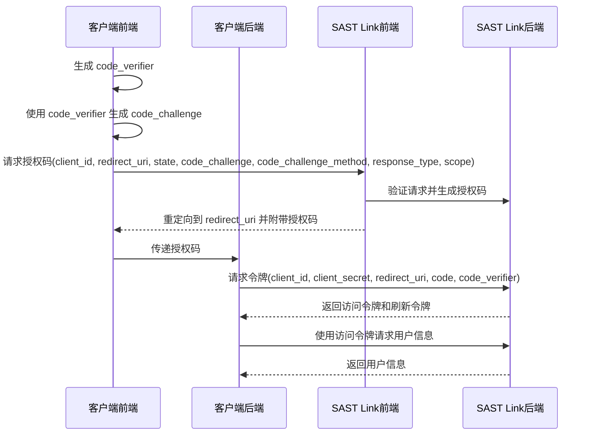

# 如何使用 SAST Link OAuth2

SAST Link OAuth 目前只实现[授权码模式](https://tools.ietf.org/html/rfc6749#section-4.1)。

## 前置准备

在开始之前，需要准备以下信息：

* 使用 [SAST Link 账号创建一个应用](TODO)，目前没有前端页面，需要使用 API 创建。
  * `redirect_uri`：授权成功后的回调地址。
  * `client_id`：应用的 ID。
  * `client_secret`：应用的密钥。

## 授权流程

1. 生成 code verifier: 生成一个随机字符串 `code_verifier`，用于后续生成 code challenge。
2. 生成 code challenge: 使用 `code_verifier` 通过 `code_challenge_method`(S256) 生成 `code_challenge`。
3. 请求授权码: 使用 `client_id`、`redirect_uri`、`state`、`code_challenge` 请求授权码。
4. 获取令牌: 使用授权码、`client_id`、`client_secret`、`redirect_uri` 请求令牌。
5. 使用令牌: 使用令牌请求用户信息。
6. 刷新令牌: 使用刷新令牌刷新令牌。

一个可能的具体授权流程如下（具体实现流程可以不同，这里只是举例）：

存在四个角色，客户端后端、客户端前端、SAST Link 后端、SAST Link 前端。

1. 客户端前端通过 `code_verifier` 使用 `code_challenge_method` 生成 `code_challenge`，并将 `code_challenge` 和 `code_challenge_method` 传递给客户端后端。
2. 客户端前端通过 `client_id`、`redirect_uri`、`state`、`code_challenge`、`response_type`、`scope` 请求授权码。
3. 客户端前端跳转至 SAST Link 登录页面，登录成功并授权后跳转至 `redirect_uri` 并附带授权码。
4. 客户端前端获取到授权码后，将授权码传递给客户端后端。
5. 客户端后端使用 `client_id`、`client_secret`、`redirect_uri`、`code` 、`code_verifier` 请求令牌。
6. 客户端后端获取令牌后，可以请求用户信息。

关于 `code_verifier` 和 `code_challenge` 比较容易引起混乱，这里简单说明一下：

* `code_verifier`：客户端生成的随机字符串，用于生成 `code_challenge`。
* `code_challenge`：客户端生成的字符串，用于验证 `code_verifier`。
* `code_challenge_method`：暂时固定值 `S256`，用于生成 `code_challenge`。

在请求授权码时，需要传递 `code_challenge` 和 `code_challenge_method`，SAST Link 会将这两个参数与授权码存放在一起。在使用授权码请求令牌时，需要传递 `code_verifier`，SAST Link 后端收到 `code_verifier` 将其进行相同的哈希运算并与最初的 `code_challenge` 进行比较。如果匹配，则认为请求有效并发放访问令牌。

流程图如下：

